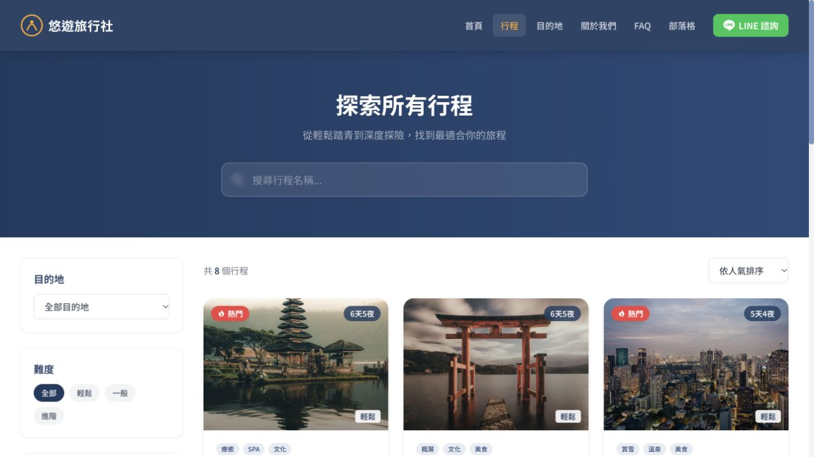

# Travel Agency Website

A React travel-catalog frontend with package search, filters, itinerary details, and a simulated enquiry form.

## Overview and status

This is a **frontend demo** using local sample packages, reviews, and editorial content. It demonstrates browsing and component design rather than a booking business. The enquiry modal validates fields and displays a local success state; it does not send a request, take payment, or create a booking.

## Screenshot



Local capture on October 6, 2026. Packages, prices, reviews, company history, and contact details are demo content, not claims about the repository owner's business.

## Key features

- Search by package name and filter by destination, difficulty, price, and duration.
- Sort by popularity, rating, or price, with a no-results state.
- Package details with itineraries and departure dates.
- Client-side enquiry validation and a simulated submission state.
- Home, destinations, about, FAQ, and blog routes.
- Shared navigation, cards, ratings, and testimonial components.

## Architecture and tech stack

```text
src/data/mock-data.json -> React page state -> filters / sorting -> package cards
React Router -> catalog and detail pages -> enquiry modal (local simulation)
Vite + TypeScript -> dist/ -> static host with SPA fallback
```

React and TypeScript implement the UI; React Router handles navigation; Tailwind CSS/PostCSS provide styling. There are no database or server API dependencies. ESLint is configured for code checks.

## Getting started

Use Node.js 22.12+ or 24 and npm.

```bash
git clone https://github.com/Lother13501350/TravelAgency_Website_Example.git
cd TravelAgency_Website_Example
npm ci
npm run dev
```

Open the URL printed by Vite. No environment variables are required.

## Build and verification

```bash
npm run build
npm run preview
npm run lint
```

`build` runs TypeScript project checks and writes `dist/`. The October 6, 2026 audit repaired missing/inconsistent optional entries in the lockfile; a clean install and build then passed. No direct application dependency version was changed by that repair.

Lint currently reports two existing issues: state updates inside a navigation effect and a `prefer-const` finding in package filtering. The build workflow verifies installation and compilation; lint is documented separately until these findings are resolved. There is no automated unit or browser test suite. A manual browser check confirmed package search reduced eight packages to the matching Hokkaido package.

## Project structure

```text
src/components/       Shared layout, navigation, cards, enquiry modal
src/pages/            Route-level screens
src/data/mock-data.json
src/utils/            Price formatting
src/App.tsx           Route definitions
src/main.tsx          Entry point
vercel.json           Static build and SPA route fallback
```

## Deployment and engineering highlights

Run `npm run build` and serve `dist/`. Routes must fall back to `index.html`; `vercel.json` configures this for Vercel. A verified public demo URL is not currently listed.

The engineering scope is client-side state, filtering/sorting, reusable components, routing, and form states. Sample content and a simulated form limit the project's value as full-stack evidence. No license file is included.

## Dependency audit snapshot

The October 6, 2026 lockfile audit reported 17 affected dependency entries. These include no critical entries in this snapshot. This is a dependency advisory result, not proof of exploitability in this deployment. No automatic upgrade was applied; review affected runtime paths and verify a security update separately.
